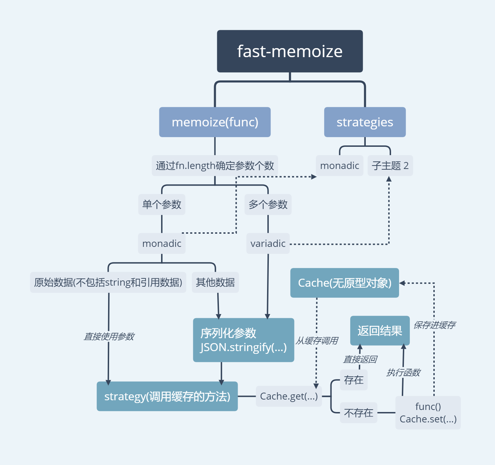

至今天(2018年7月15日)，这2个工具的实现源码思想是极其相似的，基本上，只要阅读了其中一个源码，也就了解了另外一个的实现。

fast-memoize导图:



## 初识

大概说说它们的实现思路：

1. 定义缓存结构，其中`fast`使用了`无prototype的对象`，`nano`使用了`普通对象`。
2. 定义序列化方法：当检测到是单参数时，都是选择JSON.stringify，而多个参数，两者有不同（后面再说）。
3. 定义策略：也就是缓存的具体方法，其实很简单，就是对当前缓存结构查找，找到就返回，找不到就重新运行，
    两者都使用了`bind`方法注入参数，可以省去运行时再去查找参数。
    
接着分析两者的异同：

相同处：

* 都使用了`JSON.stringify`作为序列化方法，因为它是原生的。
* 都对返回的缓存函数进行了参数注入（这是一个极大提升性能的方法）。
* 对单参数还是多参数的判断都是使用`func.length`(形参的数量判断)，因为`func.length`比`arguments.length`这种动态判断性能会好很多。

不同点：
* `fast`使用了`无prototype的对象`，`nano`使用了`普通对象`(这一点性能上相差不多)。
* 当遇到多个参数时，`fast`还是继续对`arguments`进行序列化，而`nano`则复杂一点，它通过用数组将每一次多个参数保存起来，
后续通过遍历每个参数进行全等对比`===`，判断是否从缓存调取结果。
* 同样是多个参数，`nano`增加了一个参数`max`，可以让用户自定义需要进行对比参数的长度。

## 深入
接着看下第二点不同点的源码：
主要看`nano-memoize`：
```js
function multiple(f,k,v,eq,change,max=0,...args) {
      // 用来储存i(当前对比的参数索引)和缓存值
      const rslt = {};
      // k是一个专门存放多个参数的数组 格式类似
      // [[...args],[...args],[...args]...]
      for(let i=0;i<k.length;i++) { // an array of arrays of args
        let key = k[i];
        // 判断是否需要使用max
        if(max) { key = key.slice(0,max); }
        // 当前长度相等或者有max值，开始进行对比
        if(key.length===args.length || (max && key.length<args.length)) {
          // 获取长度
          const max = key.length - 1;
          for(let j=0;j<=max;j++) {
            // 如果发现不等，直接跳出
            if(!eq(key[j],args[j])) { break; } // go to next key if args don't match
            // 当到了最后一项都没跳出 说明参数相同
            if(j===max) { // the args matched
              // 记录当前索引
              rslt.i = i;
              // 调用当前参数的缓存
              rslt.v = v[i]; // get the cached value
            }
          }
        }
      }
      // 如果有i 说明是调用缓存，如果没有i，则添加缓存
      const i = rslt.i>=0 ? rslt.i : v.length;
      if(change) { change(i); }
      // 如果缓存不存在就执行func，存在直接返回缓存
      return typeof rslt.v === "undefined" ? v[i] = f.call(this,...(k[i] = args)) : rslt.v;
    }
```

可以看出，这是通过2次遍历，对` [[...args],[...args],[...args]...]`这样一种结构比较，外层遍历判断length，
length相等才会进入内层遍历，内层遍历就是逐个判断了。

```js
// 注入参数，提升性能
f = multiple.bind(
        this,
        fn,
        k,
        v,
        // 逐个判断方式默认为 ===
        equals || ((a,b) => a===b), // default to just a regular strict comparison
        (maxAge ? change.bind(this,v): null), // turn change logging on and bind to arg cache v
        maxArgs
      );
```

上面一段则是参数注入方式和默认的对比方式。

## 总结
一个表格总结两者最大不同，假设：
* 忽略===的执行时间
* 使用的参数分为 引用相同 和 引用不同(但是深比较为true)

|*耗时操作*|*多个参数(引用相同)*|   |*多个参数(引用不同)*|    |
|------|--------|---------|----------|----------|
|状态  |首次运行 |后续运行|首次运行  |  后续运行|
|fast  |序列化+运行|序列化|序列化+运行|序列化|
|nano  |运行|0|运行|运行|

