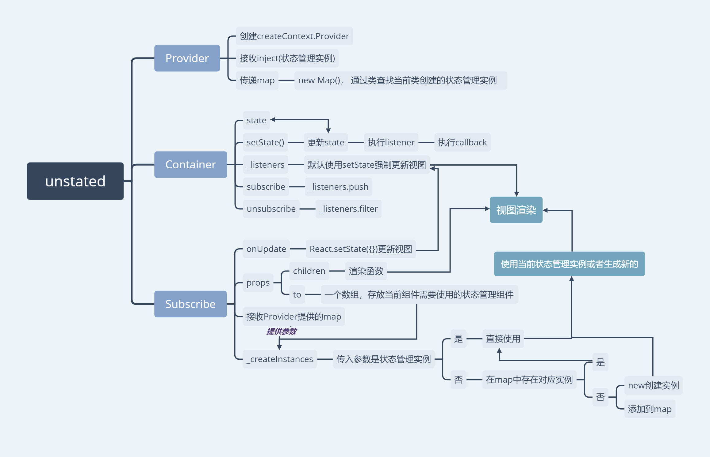

## 简介

`unstated`是一个极简的状态管理组件

> 看它的简介：State so simple, it goes without saying

## 对比

### 对比redux：

* 更加灵活(相对的缺点是缺少规则，需要使用者的自觉)
    
    `redux`的状态是存放在一棵树内，采用严格的单向流
    
    `unstated`的状态是用户自己定义，说白了就是`object`，可以放在一个组件的内，也可以放在多个组件内

* 针对`React`，一致的`API`

    `redux`必须编写`reducer`和`action`，通过`dispatch(action)`改变状态，它不限框架
    
    `unstated`**改变状态的`API`完全与`React`一致**，使用`this.setState`，当然和`React`的`setState`不同，
    但是它的底层也是用到了`setState`去更新视图
    
* 功能相对简单

    `unstated`没有中间件功能，每次状态改变(不管是否相等)，都会重新渲染(`V2.1.1`)
    
    可以自定义`listener`，每次更新状态时都会执行。
    
### 对比React的自带state：

* 天生将组件分割为`Container(状态管理)`和`Component(视图管理)`
* 灵活配置共享状态或者私有状态
* 支持`promise`

## 初识

3大板块和几个关键变量

```
Provider: 注入状态实例，传递map，本质是Context.Provider，可嵌套达成链式传递
Container: 状态管理类，遵循React的API，发布订阅模式，通过new生成状态管理实例
Subscribe: 订阅状态组件，本质是Context.Consumer，接收Provider提供的map，视图渲染组件
map: new Map()，通过类查找当前类创建的状态管理实例
```

## 深入

这里引入官方例子

```typescript jsx
// @flow
import React from 'react';
import { render } from 'react-dom';
import { Provider, Subscribe, Container } from 'unstated';

type CounterState = {
  count: number
};
// 定义一个状态管理类
class CounterContainer extends Container<CounterState> {
  state = {
    count: 0
  };

  increment() {
    this.setState({ count: this.state.count + 1 });
  }

  decrement() {
    this.setState({ count: this.state.count - 1 });
  }
}
// 渲染视图组件(Context.Consumer的模式)
function Counter() {
  return (
    <Subscribe to={[CounterContainer]}>
      {counter => (
        <div>
          <button onClick={() => counter.decrement()}>-</button>
          <span>{counter.state.count}</span>
          <button onClick={() => counter.increment()}>+</button>
        </div>
      )}
    </Subscribe>
  );
}

render(
  <Provider>
    <Counter />
  </Provider>,
  document.getElementById('root')
);
```

这里`Counter`是我们自定义的视图组件，首先使用`<Provider>`包裹，接着在`Counter`内部，调用`<Subscribe>`组件，
传递一个数组给`props.to`，这个数组内存放了`Counter`组件需要使用的`状态管理类`(此处也可传递`状态管理实例`)。

### Provider

```typescript jsx
export function Provider(props: ProviderProps) {
  return (
    <StateContext.Consumer>
      {parentMap => {
        let childMap = new Map(parentMap);
        // 外部注入的状态管理实例
        if (props.inject) {
          props.inject.forEach(instance => {
            childMap.set(instance.constructor, instance);
          });
        }

        // 负责将childMap传递，初始为null
        return (
          <StateContext.Provider value={childMap}>
            {props.children}
          </StateContext.Provider>
        );
      }}
    </StateContext.Consumer>
  );
}
```

这里的模式是

```jsx harmony
<Consumer>
  ()=>{
    /* ... */
    return <Provider>{props.children}<Provider />
  }
</Consumer>  
```

有3个注意点：

1. 外层嵌套`<Consumer>`可以嵌套调用。

    ```jsx harmony
    <Provider value={...}>
     /* ... */
     <Provider value={此处继承了上面的value}>
     /* ... */ 
    </Provider>
    ``` 
2. `props.inject`可以注入现成的`状态管理实例`，添加到`map`之中。

3. 返回值写成`props.children`。
    
###  返回值写成props.children的意义
  
简单一句话概括，这么写可以避免`React.Context`改变导致子组件的重复渲染。
    
具体看这里：[避免React Context导致的重复渲染](https://zhuanlan.zhihu.com/p/50336226)

### Container

```typescript jsx
export class Container<State: {}> {
  // 保存状态 默认为{}
  state: State;
  // 保存监听函数，默认为[]
  _listeners: Array<Listener> = [];

  setState(
    updater: $Shape<State> | ((prevState: $Shape<State>) => $Shape<State>),
    callback?: () => void
  ): Promise<void> {
    return Promise.resolve().then(() => {
      let nextState;

      /* 利用Object.assign改变state */

      // 执行listener(promise)
      let promises = this._listeners.map(listener => listener());

      // 所有Promise执行完毕
      return Promise.all(promises).then(() => {
        // 全部listener执行完毕，执行回调
        if (callback) {
          return callback();
        }
      });
    });
  }

  // 增加订阅(这里默认的订阅就是React的setState空值(为了重新渲染)，也可以添加自定义监听函数)
  subscribe(fn: Listener) {
    this._listeners.push(fn);
  }

  // 取消订阅
  unsubscribe(fn: Listener) {
    this._listeners = this._listeners.filter(f => f !== fn);
  }
}
```
`Container`内部逻辑很简单，改变`state`，执行监听函数。

其中有一个`_listeners`，是用于存放监听函数的。

每个`状态管理实例`存在一个默认监听函数`onUpdate`，
这个默认的监听函数的作用就是`调用React的setState强制视图重新渲染`。

这里的监听函数内部返回`Promise`，最后通过`Promise.all`确保执行完毕，然后执行`回调参数`。

因此`setState`在外面使用也可以使用`then`。

例如，在官方例子中：

```js
increment() {
    this.setState({ count: this.state.count + 1 },()=>console.log('2'))
    .then(()=>console.log('3') )
    console.log('1') 
  }
  // 执行顺序是 1 -> 2 ->3
```

2个注意点：

1. `setState`和`React API`一致，第一个参数传入object或者function，第二个传入回调

2. 这里通过`Promise.resolve().then`模拟`this.setState`的异步执行

### 关于Promise.resolve和setTimeout的区别
    
简单的说两者都是异步调用，`Promise`更快执行。

* `setTimeout(()=>{},0)`会放入下一个新的`任务队列`

* `Promise.resolve().then({})`会放入`微任务`，在调用栈为空时立刻补充调用栈并执行(简单理解为当前`任务队列`尾部)

更多详细可以看这里提供的2个视频：`https://stackoverflow.com/a/38752743`

### Subscribe

```typescript jsx
export class Subscribe<Containers: ContainersType> extends React.Component<
  SubscribeProps<Containers>,
  SubscribeState
> {
  state = {};
  // 存放传入的状态组件
  instances: Array<ContainerType> = [];
  unmounted = false;

  componentWillUnmount() {
    this.unmounted = true;
    this._unsubscribe();
  }

  _unsubscribe() {
    this.instances.forEach(container => {
      // container为当前组件的每一个状态管理实例
      // 删除listeners中的this.onUpdate
      container.unsubscribe(this.onUpdate);
    });
  }

  onUpdate: Listener = () => {
    return new Promise(resolve => {
      // 组件未被卸载
      if (!this.unmounted) {
        // 纯粹是为了让React更新组件
        this.setState(DUMMY_STATE, resolve);
      } else {
        // 已经被卸载则直接返回
        resolve();
      }
    });
  };
  
  /* ... */
}
```

这里的关键就是`instances`，用于存放当前组件的`状态管理实例`。

当组件`unmount`的时候，会`unsubscribe`当前`状态管理实例`的默认监听函数，那么如果当前的`状态管理实例`是共享的，会不会有影响呢？

不会的。往后看可以知道，当`state`每次更新，都会重新创建新的`状态管理实例`(因为`props.to`的值可能会发生变化，例如取消某一个`状态管理实例`)，
而每次创建时，都会先`unsubscribe`再`subscribe`，确保不会重复添加监听函数。

`onUpdate`就是创建`状态管理组件`时默认传递的监听函数，用的是`React`的`setState`更新一个`DUMMY_STATE`(空对象`{}`)。

```typescript jsx
export class Subscribe<Containers: ContainersType> extends React.Component<
  SubscribeProps<Containers>,
  SubscribeState
> {
  /* 上面已讲 */

  _createInstances(
    map: ContainerMapType | null,
    containers: ContainersType
  ): Array<ContainerType> {
    // 首先全部instances解除订阅
    this._unsubscribe();

    // 必须存在map 必须被Provider包裹才会有map
    if (map === null) {
      throw new Error(
        'You must wrap your <Subscribe> components with a <Provider>'
      );
    }

    let safeMap = map;
    // 重新定义当前组件的状态管理组件(根据to传入的数组)
    let instances = containers.map(ContainerItem => {
      let instance;

      // 传入的是Container组件，则使用
      if (
        typeof ContainerItem === 'object' &&
        ContainerItem instanceof Container
      ) {
        instance = ContainerItem;
      } else {
        // 传入的不是Container，可能是其他自定义组件等等(需要用new执行)，尝试获取
        instance = safeMap.get(ContainerItem);

        // 不存在则以它为key，value是新的Container组件
        if (!instance) {
          instance = new ContainerItem();
          safeMap.set(ContainerItem, instance);
        }
      }

      // 先解绑再绑定，避免重复订阅
      instance.unsubscribe(this.onUpdate);
      instance.subscribe(this.onUpdate);

      return instance;
    });

    this.instances = instances;
    return instances;
  }
  
  /* ... */
}
```

在`_createInstances`内部，如果检查到传入的`props.to`的值已经是`状态管理实例`(私有状态组件)，那么直接使用即可，
如果传入的是`类class`(共享状态组件)，会尝试通过查询`map`，不存在的则通过`new`创建。

```typescript jsx
export class Subscribe<Containers: ContainersType> extends React.Component<
  SubscribeProps<Containers>,
  SubscribeState
> {
  
  /* 上面已讲 */
  
  render() {
    return (
      <StateContext.Consumer>
      /* Provider传递的map */
      {map =>
          // children是函数
          this.props.children.apply(
            null,
            // 传给子函数的参数(传进当前组件的状态管理实例)
            this._createInstances(map, this.props.to)
          )
        }
      </StateContext.Consumer>
    );
  }
}
```

每一次`render`都会创建新的`状态管理实例`。

到此，3大板块已经阅读完毕。

## 总结

1. 简单易用，与`React`一致的`API`，一致的书写模式，让使用者很快上手。

2. 并没有规定如何管理这些`状态管理类`，非常灵活。

    我们可以学`redux`将所有状态放到一个`共享状态管理实例`内部，
    例如通过`Provider`的`inject`属性注入，
    
    或者针对每一个组件创建单独的`状态管理实例`(可共享可独立)(`unstated`作者推荐)，
    
    一切可以按照自己的想法，但同时也要求使用者自己定义一些规则去约束写法。

3. 仅仅是管理了状态，每次更新都是一个全新的`instance`集合，并没有做任何对比，需要我们在视图层自己实现。

4. 返回值写成`props.children`的[意义](#返回值写成props.children的意义)。

5. 关于`Promise.resolve().then({})`和`setTimeout(()=>{},0)`的[区别](#关于Promise.resolve和setTimeout的区别)。

## 导图




